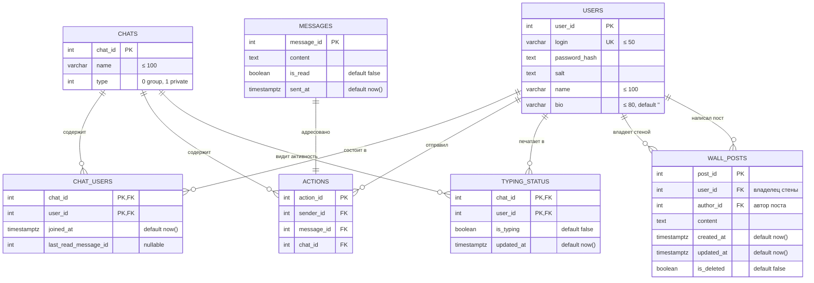

# Структура базы данных - Seagull Messenger

Вся схема живёт в `seagull_schema`. Источник истины: [postgresql/schemas/db_1.sql](../postgresql/schemas/db_1.sql).

## ER-диаграмма



## Таблицы

### `seagull_schema.users`

| Поле | Тип | Описание |
|---|---|---|
| `user_id` | `serial` PK | уникальный ID пользователя |
| `login` | `varchar(50)` UNIQUE NOT NULL | логин для входа |
| `password_hash` | `text` NOT NULL | SHA-256 от `password + salt` |
| `salt` | `text` NOT NULL | соль для хеша |
| `name` | `varchar(100)` NOT NULL | отображаемое имя |
| `bio` | `varchar(80)` DEFAULT `''` | описание профиля |

Используется в: `register`, `login`, `get_user_profile`, `update_user`, `search_users`.

### `seagull_schema.chats`

| Поле | Тип | Описание |
|---|---|---|
| `chat_id` | `serial` PK | уникальный ID чата |
| `name` | `varchar(100)` NOT NULL | название (для групп) или техническое имя для приватных (`private_{u1}_{u2}`) |
| `type` | `int` NOT NULL DEFAULT `0` | `0` — group, `1` — private |

В API наружу `type` отдаётся как `type_name = "group" \| "private"`.

### `seagull_schema.chat_users`

| Поле | Тип | Описание |
|---|---|---|
| `chat_id` | `int` FK→`chats.chat_id` ON DELETE CASCADE | составная PK |
| `user_id` | `int` FK→`users.user_id` ON DELETE CASCADE | составная PK |
| `joined_at` | `timestamptz` DEFAULT `now()` | дата присоединения |
| `last_read_message_id` | `int` DEFAULT `NULL` | максимальный `message_id`, который пользователь прочёл в этом чате |

`last_read_message_id` обновляется в `get_messages` (как побочный эффект при чтении) и в `mark_messages_read`.

### `seagull_schema.messages`

| Поле | Тип | Описание |
|---|---|---|
| `message_id` | `serial` PK | уникальный ID сообщения |
| `content` | `text` NOT NULL | текст |
| `is_read` | `boolean` DEFAULT `false` | флаг прочитанности (поднимается в `mark_messages_read`) |
| `sent_at` | `timestamptz` DEFAULT `now()` | время отправки в UTC |

Связь с чатом и отправителем хранится в отдельной таблице `actions` (one-to-one). В API `sent_at` форматируется как `to_char(... AT TIME ZONE 'Europe/Moscow', 'DD.MM.YYYY HH24:MI:SS')`.

### `seagull_schema.actions`

| Поле | Тип | Описание |
|---|---|---|
| `action_id` | `serial` PK | уникальный ID записи |
| `sender_id` | `int` FK→`users.user_id` ON DELETE CASCADE | автор сообщения |
| `message_id` | `int` FK→`messages.message_id` ON DELETE CASCADE | ссылка на сообщение |
| `chat_id` | `int` FK→`chats.chat_id` ON DELETE CASCADE | чат, куда отправлено |

Фактически это «таблица связей» между сообщением и чатом/автором (исторически выделено отдельно). Каждой записи `messages` соответствует ровно одна запись `actions`.

### `seagull_schema.typing_status`

| Поле | Тип | Описание |
|---|---|---|
| `chat_id` | `int` FK→`chats.chat_id` ON DELETE CASCADE | составная PK |
| `user_id` | `int` FK→`users.user_id` ON DELETE CASCADE | составная PK |
| `is_typing` | `boolean` DEFAULT `false` | статус «печатает» |
| `updated_at` | `timestamptz` DEFAULT `now()` | время последнего апдейта |

Эндпоинт `POST /api/chat/{chat_id}/typing` пишет сюда c `ON CONFLICT … DO UPDATE`. `GET /api/chat/{chat_id}/typing` показывает только записи, где `is_typing = TRUE AND updated_at > NOW() - INTERVAL '5 seconds'`.

### `seagull_schema.wall_posts`

| Поле | Тип | Описание |
|---|---|---|
| `post_id` | `serial` PK | уникальный ID поста |
| `user_id` | `int` NOT NULL FK→`users.user_id` ON DELETE CASCADE | владелец стены |
| `author_id` | `int` NOT NULL FK→`users.user_id` ON DELETE CASCADE | автор поста (может совпадать с владельцем) |
| `content` | `text` NOT NULL | текст поста (до 1000 символов на стороне API) |
| `created_at` | `timestamptz` DEFAULT `now()` | время создания |
| `updated_at` | `timestamptz` DEFAULT `now()` | время последнего изменения |
| `is_deleted` | `boolean` DEFAULT `false` | soft-delete |

`DELETE /api/wall/post/{post_id}` ставит `is_deleted = true` (физически запись не удаляется). При выборке постов фильтр `is_deleted = false`.

## SQL Schema Definition

```sql
DROP SCHEMA IF EXISTS seagull_schema CASCADE;

CREATE SCHEMA IF NOT EXISTS seagull_schema;

CREATE TABLE IF NOT EXISTS seagull_schema.users (
    user_id       SERIAL PRIMARY KEY,
    login         VARCHAR(50) UNIQUE NOT NULL,
    password_hash TEXT NOT NULL,
    salt          TEXT NOT NULL,
    name          VARCHAR(100) NOT NULL,
    bio           VARCHAR(80) DEFAULT ''
);

CREATE TABLE IF NOT EXISTS seagull_schema.messages (
    message_id SERIAL PRIMARY KEY,
    content    TEXT NOT NULL,
    is_read    BOOLEAN DEFAULT FALSE,
    sent_at    TIMESTAMPTZ DEFAULT CURRENT_TIMESTAMP
);

CREATE TABLE IF NOT EXISTS seagull_schema.chats (
    chat_id SERIAL PRIMARY KEY,
    name    VARCHAR(100) NOT NULL,
    type    INT NOT NULL DEFAULT 0
);

CREATE TABLE IF NOT EXISTS seagull_schema.chat_users (
    chat_id              INT REFERENCES seagull_schema.chats(chat_id) ON DELETE CASCADE,
    user_id              INT REFERENCES seagull_schema.users(user_id) ON DELETE CASCADE,
    joined_at            TIMESTAMPTZ DEFAULT CURRENT_TIMESTAMP,
    last_read_message_id INT DEFAULT NULL,
    PRIMARY KEY (chat_id, user_id)
);

CREATE TABLE IF NOT EXISTS seagull_schema.typing_status (
    chat_id    INT REFERENCES seagull_schema.chats(chat_id) ON DELETE CASCADE,
    user_id    INT REFERENCES seagull_schema.users(user_id) ON DELETE CASCADE,
    is_typing  BOOLEAN DEFAULT FALSE,
    updated_at TIMESTAMPTZ DEFAULT CURRENT_TIMESTAMP,
    PRIMARY KEY (chat_id, user_id)
);

CREATE TABLE IF NOT EXISTS seagull_schema.actions (
    action_id  SERIAL PRIMARY KEY,
    sender_id  INT REFERENCES seagull_schema.users(user_id)       ON DELETE CASCADE,
    message_id INT REFERENCES seagull_schema.messages(message_id) ON DELETE CASCADE,
    chat_id    INT REFERENCES seagull_schema.chats(chat_id)       ON DELETE CASCADE
);

CREATE TABLE IF NOT EXISTS seagull_schema.wall_posts (
    post_id    SERIAL PRIMARY KEY,
    user_id    INT NOT NULL REFERENCES seagull_schema.users(user_id) ON DELETE CASCADE,
    author_id  INT NOT NULL REFERENCES seagull_schema.users(user_id) ON DELETE CASCADE,
    content    TEXT NOT NULL,
    created_at TIMESTAMPTZ DEFAULT CURRENT_TIMESTAMP,
    updated_at TIMESTAMPTZ DEFAULT CURRENT_TIMESTAMP,
    is_deleted BOOLEAN DEFAULT FALSE
);
```

## Особенности и инварианты

- **Приватные чаты** создаются автоматически при первом сообщении (`POST /api/messages/send` с `chat_id = 0` и `receiver_id`). `chats.name` для них имеет формат `private_{u1}_{u2}`, но наружу всегда отдаётся `display_name` — имя собеседника.
- **Групповые чаты** создаются явно через `POST /api/chats/group`. Создатель автоматически попадает в `chat_users`.
- **Связка сообщение↔чат↔автор** живёт в `actions` (исторически отдельная таблица). Запросы вроде «сообщения чата» делают `JOIN actions ON message_id`.
- **Прочитанность** хранится двойственно: глобальный `messages.is_read` (true, когда кто-то прочитал не своё сообщение) и точный курсор `chat_users.last_read_message_id` на каждого участника. Сводка непрочитанных считается через `last_read_message_id`.
- **`typing_status`** — short-lived TTL (5 секунд) по `updated_at`. Старые записи не удаляются, просто перестают учитываться при выдаче.
- **`wall_posts`** — soft-delete: при удалении ставится `is_deleted = true`, физически запись остаётся.
- **Каскадное удаление**: при удалении пользователя удаляются все его участия в чатах, действия (а с ними и связанные сообщения через FK… фактически нет: `messages` не имеет FK на `users`, удалится только `actions`), статус печати и посты на/от него.
